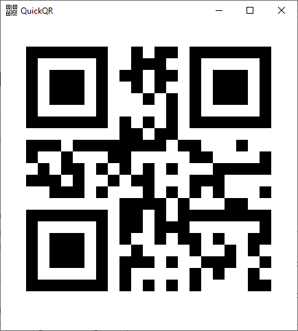

# QuickQR

> Read text from clipboard and generate QR code, only for windows.

## Screen shot

## Download
Download these 2 files:
- [QuickQR.exe](https://github.com/leehooi/QuickQR/raw/master/QuickQR/bin/Debug/QuickQR.exe)
- [Gma.QrCodeNet.Encoding.dll](https://github.com/leehooi/QuickQR/raw/master/QuickQR/bin/Debug/Gma.QrCodeNet.Encoding.dll)

## Usage
Copy text, then open *QuickQR.exe*.